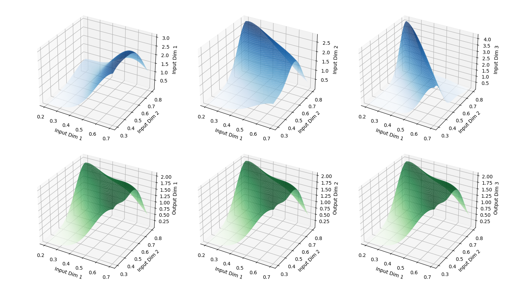

# CBIMK - Compositional Bayesian Inversion with Stochastic Markov Kernels

  

## Markov Kernels and Bayesian Inversions

In various scientific and engineering applications, we often encounter systems that exhibit probabilistic transitions between different states over time. Such systems can be elegantly modelled using Markov kernels. A Markov kernel is a mathematical construct that characterizes the probabilistic evolution of states in a Markov process.

Intuitively, a Markov kernel can be thought of as a "transition rule" that dictates how the probabilities of being in different states change from one time step to another. The core idea is that the future state probabilities depend solely on the current state probabilities and not on the history of states.

On the other hand, Bayesian inversion is a powerful technique used to infer the underlying structure of a system from observed data. In the context of Markov kernels, Bayesian inversion aims to learn the inverse transformation that maps the probabilities of states at a given time step back to the probabilities at the previous time step.

## Compositional Bayesian Inversion

The Compositional Bayesian Inversion of Markov Kernels combines the strengths of Markov kernels and Bayesian inversion in a novel and efficient manner. The approach involves constructing a Bayesian inverter, which learns to approximate the inverse transformation of a given Markov kernel.

In this implementation, we represent the Markov kernel using a transition matrix, where each entry indicates the probability of transitioning from one state to another. The Bayesian inverter is modelled as a neural network, which is trained to learn the inverse transformation of the Markov kernel.

The key insight is that by composing the Markov kernel with the Bayesian inverter, we can obtain an approximate inverse transformation, allowing us to infer the initial state probabilities given the probabilities at a subsequent time step in a transition timeline.

## Key Components

1. **MarkovKernel**: Represents a Markov kernel with a given transition matrix, which models the probabilistic transition between states in a Markov process using a transition matrix and input data.
2. **BayesianInverter**: A neural network-based Bayesian inverter, which learns to approximate the inverse transformation of a given Markov kernel.

Additionally, the code provides a composition function, `compose`, which combines the Markov kernel and the Bayesian inverter to create a newly composed transformation from the transition matrix and inputted data.

## Usage

1. **Define the Transition Matrix**: To begin, you need to define the transition matrix for your Markov kernel. This matrix should represent the probabilities of transitioning between states in your Markov process.
2. **Create Instances of MarkovKernel and BayesianInverter**: Instantiate the `MarkovKernel` class with the defined transition matrix and the `BayesianInverter` class with the appropriate input and output dimensions.
3. **Apply the Composed Kernel**: Use the `compose` function to combine the Markov kernel and the Bayesian inverter. Apply the resulting composed kernel to your input data to approximate the inverse transformation.
