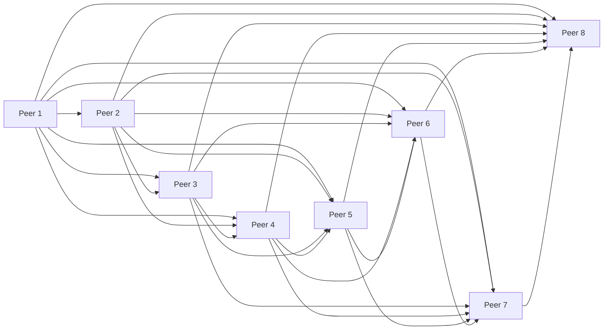
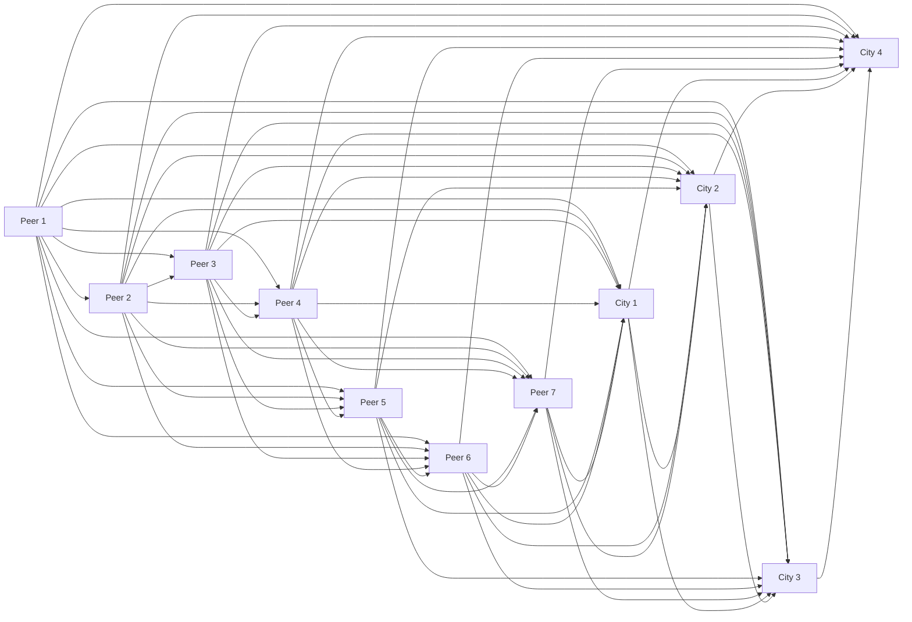

# Plurigrid Protocol and Citylearn Components

Plurigrid is a protocol for decentralized, distributed, peer-to-peer networks. It is designed to enable efficient, secure, and resilient communication between peers in a distributed network. It is used to facilitate the exchange of data, resources, and services between peers in a network. Citylearn is a component of Plurigrid that enables users to create virtual cities.

The following mermaid diagrams illustrate the components of Plurigrid protocol and Citylearn. 

## Plurigrid Protocol

## Citylearn

